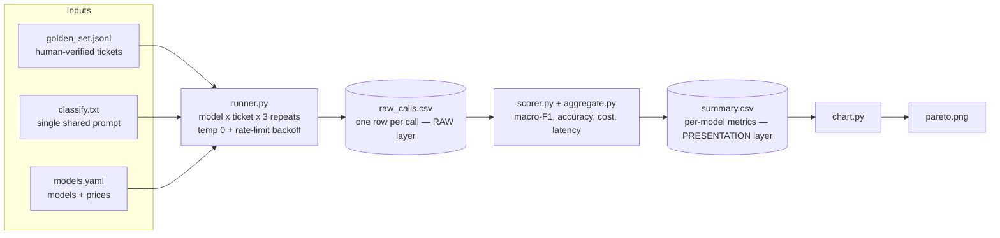

# Project docs — lab notebook & report source

This folder is the **build journal** for `triage-bakeoff`. Each phase records *what was
built, why, the decisions made, the visuals, and the metrics* — in a form that assembles
directly into the public README and the final report.

| Where | What it holds |
|---|---|
| Root [`../README.md`](../README.md) | Public-facing methodology + results summary |
| Root [`../CLAUDE.md`](../CLAUDE.md) | Quick build tracker (phase checkboxes, gotchas) |
| [`decisions.md`](decisions.md) | The "why" behind every choice (decision log) |
| [`phases/`](phases/) | Per-phase detail (goal, build, decisions, visuals, metrics) |
| Root [`../writeup/findings.md`](../writeup/findings.md) | The final report, assembled at the end |

## System at a glance



**Two-layer results (key design choice):** every API call is logged raw to `raw_calls.csv`
and never edited; `summary.csv` is *computed from it*. A scoring bug is a free re-run, not a
re-spend. See [decisions.md → D6](decisions.md).

## Phase index

| Phase | Doc | Status |
|---|---|---|
| 0 — Repo & scaffold | [phases/phase-0-repo-and-scaffold.md](phases/phase-0-repo-and-scaffold.md) | ✅ done |
| 1 — Contracts & config | [phases/phase-1-contracts-and-config.md](phases/phase-1-contracts-and-config.md) | ✅ done |
| 2 — Synthetic golden set | _pending_ | ⬜ |
| 3 — Providers & runner | _pending_ | ⬜ |
| 4 — Scorer, aggregation, tests | _pending_ | ⬜ |
| 5 — Live run & chart | _pending_ | ⬜ |
| 6 — Writeup | _pending_ | ⬜ |

## How these docs assemble into the report

`writeup/findings.md` is the deliverable (~800–1,200 words). Each section pulls from here:

| Report section | Source docs |
|---|---|
| Problem / motivation | `PROJECT_BRIEF.md`, phase-0 |
| Method — task & schema | phase-1 |
| Method — golden set & rubric | phase-2, `data/rubric.md` |
| Method — harness, providers, rate-limit handling | phase-3 |
| Results — metrics tables | phase-4, phase-5 |
| Results — Pareto chart | phase-5 |
| Findings & production recommendation | phase-6 |
| Methodology notes / "decisions I made" sidebar | `decisions.md` |

## Maintenance rule

Whenever a phase is finished or changed:
1. Update or create its `phases/phase-N-*.md` (use the template below).
2. Append any new decision to [`decisions.md`](decisions.md).
3. Tick the box + add a progress-log line in [`../CLAUDE.md`](../CLAUDE.md).
4. Update the Phase index table above.

Keep it truthful and dated — this folder is the single source for the final writeup.

## Per-phase doc template

```markdown
# Phase N — <title>

**Status:** in progress | done   ·   **Date:** YYYY-MM-DD   ·   **Commits:** <hashes>

## Goal
One or two sentences: what this phase had to deliver.

## What was built
Table of files/artifacts + one-line purpose each.

## Decisions made
Bullet list linking to decisions.md (e.g. "See D7 — prompt gives value definitions").
A sentence of plain-English rationale per decision.

## Visuals
Diagrams (Mermaid) and/or charts relevant to this phase.

## Metrics / evidence
Any numbers produced (verification results, counts, scores). Tables preferred.

## Report material
Polished sentences/snippets ready to drop into findings.md.

## Open items / next
What's deferred or feeds the next phase.
```
