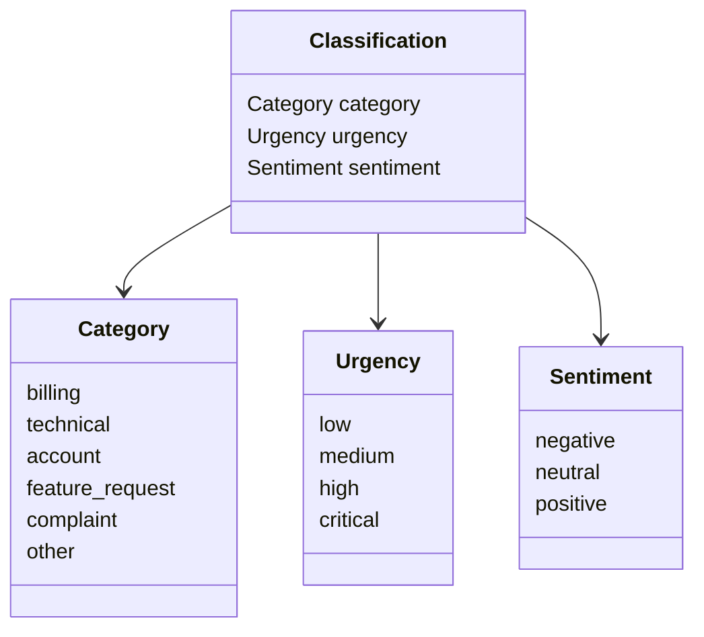
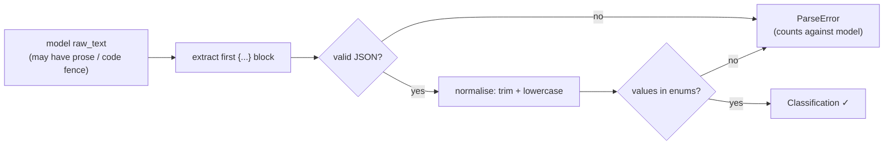

# Phase 1 — Contracts & config

**Status:** done · **Date:** 2026-06-16 · **Commits:** `c649129`

## Goal
Define the fixed "shape" of the benchmark — the structured answer, the single shared prompt,
the model list + pricing, and the labelling rubric — so every later phase builds on stable
contracts. All offline; no API keys or spend required.

## What was built

| File | Purpose |
|---|---|
| `src/schema.py` | Pydantic `Classification` (+ `Category`/`Urgency`/`Sentiment` enums) and `parse_classification()` |
| `prompts/classify.txt` | The single shared classification prompt (user-approved) |
| `config/models.yaml` | Five models with `provider`, `model_id`, `price_in`/`price_out`, `base_url` (placeholders marked `VERIFY`) |
| `data/rubric.md` | Human labelling rubric — one paragraph per field |
| `pyproject.toml`, `uv.lock`, `Makefile` | Dependencies (pinned) and `run`/`score`/`chart`/`test` targets |

## Visuals

The answer contract every model must satisfy:

How a raw reply becomes a graded answer (the parse path):

## Decisions made
- **[D5](../decisions.md)** — temperature 0, N=3 repeats, one shared prompt. *Hold everything
  constant except the model; measure consistency as a bonus.*
- **[D6](../decisions.md)** — two-layer results; malformed output is measured, not fatal. *Junk-output
  rate is a quality signal, and re-scoring never re-spends.*
- **[D7](../decisions.md)** — schema lenient on format, strict on vocabulary. *Grade classification,
  not capitalisation.*
- **[D8](../decisions.md)** — prompt defines each value + boundary rules (most-central tie-break;
  urgency by impact; sentiment by tone). *Test whether a model can follow a spec, not guess intuitions.*
- **[D9](../decisions.md)** — model IDs and prices are run-day `VERIFY` placeholders.

## Metrics / evidence
Parser smoke-tested offline (before any spend):

| Input | Expected | Result |
|---|---|---|
| Valid answer in prose + code fence, mixed caps, extra key | parse → `billing / high / negative` | ✅ parsed |
| `category: "urgent"` (not an allowed value) | reject | ✅ ParseError |
| Plain prose, no JSON | reject | ✅ ParseError |
| Missing the `sentiment` field | reject | ✅ ParseError |

Dependencies resolve cleanly: 51 packages locked in `uv.lock`.

## Report material
> Each model receives an identical prompt that defines the six categories, four urgency levels,
> and three sentiment classes, plus explicit boundary rules (e.g. *judge urgency by impact, not
> tone*). Replies are parsed leniently on format but strictly on vocabulary: case and whitespace
> are normalised identically for every model, JSON is extracted from any surrounding prose, and
> any value outside the allowed set is rejected and counted as a miss — so a model's rate of
> malformed output is itself measured rather than hidden.

## Open items / next
- Verify exact model IDs + live prices on the run day (Phase 5); set `price_snapshot_date`.
- Phase 2 — generate the ~70-ticket synthetic golden set (stratified, ~15% hard), every row
  `NEEDS REVIEW`, then a human verification pass against the rubric.
